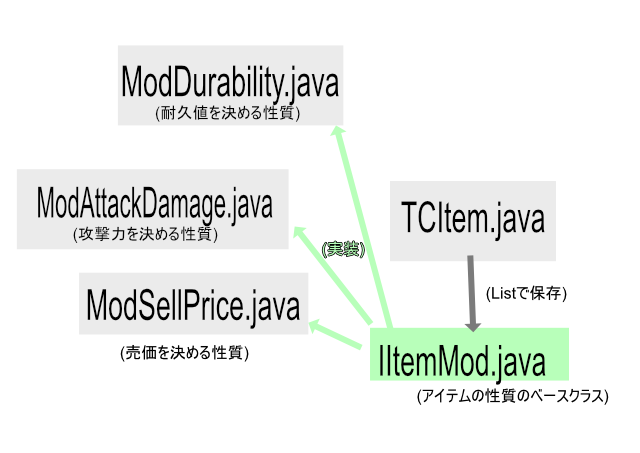
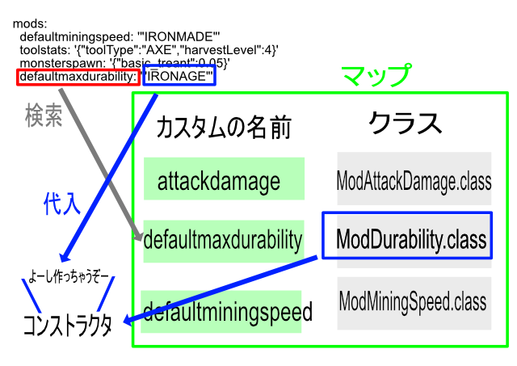

# Yamlでアイテムを書けるプラグインを自作した話 - RIBLaBブログ

このブログでは、Minecraftでプラグインを開発する私の頭の中を提供します。  
・ 想定読者層：既にある程度Minecraftのプラグインが書ける人  
<!-- more -->
・ Minecraftのバージョン:1.20.1  
・ 言語：java  

# MythicCrucibleについて

皆さんは「MythicMobs」を使ってモブを作ったことがありますか？  

https://www.spigotmc.org/resources/%E2%9A%94-mythicmobs-free-version-%E2%96%BAthe-1-custom-mob-creator%E2%97%84.5702/

MythicMobsはとても有名な、すごくカスタマイズされたモブやアイテムを作ることができるプラグインです。  
マイクラマルチをやっていると、時折変なAIを持った敵を見かけますが、あれもこれもMythicMobsで作られています（たぶん）。  
しかも、あれら何十種類もの性質は全てプログラムではなくYamlだけで定義することができます。  
[MythicCrucible](https://mythiccraft.io/index.php?resources/crucible-create-unbelievable-mythic-items.2/)はそのアドオンで、MythicMobsのアイテムに更に色んなカスタムを加えられるプラグインです。  
今回はこれのアイテム読み書き機能を再現します。  

# 自作する理由

普通に、**有料**だからです。 
MythicMobsとMythicCrucbieを両方買うと結構な値段します。  
これはお財布に優しくありません。
<br>
他にもカスタムアイテムを作れるプラグインがspigotに多くありますが、やはりどれも有料です。
<br>
ということで自作をします。  
(今考えると普通に面倒くさかったので、全て自作したいという変なこだわりのない方は普通に買った方がいいです。)

# 最初の課題

アイテムのプログラムの仕方は趣旨から外れるのでここでは扱いません。  
もしかしたらいつか別の記事で触れるかも...?  
<br>
<br>
アイテムクラスをYamlで表現する場合、まずそのインスタンスからプロパティを読み取って保存する方法を決めなくてはいけません。  
私がこれまで書いていたコードでは、アイテムをベースクラスとして実装し、ツールや武器などをカテゴリ別に分けて子クラスとして実装していました。  
具体的には以下のような感じです。  


この状態で保存しようとすると、  
1. アイテムクラスを保存して、他のクラスのプロパティは無視する  
2. アイテムのサブクラスごとにカスタムのシリアライザ(保存クラス)を作って、派生クラスが増えるたびに保存用のクラスも増やす  
の二択しかありません。  
<br>
これを繰り返すと意味のないフィールドやクラスが大量に生まれてしまうので、よりよい方法を考えなくてはいけません。  
  
# 最初の課題の解決策

この問題をMythicMobs(無料版)はどのようにして解決しているのでしょうか?  
少しコードを覗いて見ましょう。  
(※以下に示すコードはJavaでMythicMobsを定義するためのコードなので、オリジナルとは少し異なります)  

```
    public MMJavaMobType(MobExecutor manager, String internalName, String mobtype, String displayName) {
        this.despawnMode = DespawnMode.NORMAL;
        this.optionShowHealthInChat = false;
        this.optionSilent = false;
        this.optionNoAI = false;
        this.optionGlowing = false;
        this.optionInvincible = false;
        this.optionCollidable = true;
        this.optionNoGravity = true;
        this.optionInteractable = true;
        this.optionHealOnReload = false;
        this.optionLockPitch = false;
        this.useBossBar = false;
        this.mount = Optional.empty();
        this.rider = Optional.empty();
        this.levelmods = Lists.newArrayList();
        this.aiGoalSelectors = Lists.newArrayList();
        this.aiTargetSelectors = Lists.newArrayList();
        this.aiPathfindingMalus = Maps.newConcurrentMap();
        this.hasCombatSkills = false;
        this.skills = Maps.newConcurrentMap();
        this.timerSkills = Queues.newConcurrentLinkedQueue();
        this.signalSkills = Maps.newConcurrentMap();
        this.usingTimers = false;
        this.alwaysShowName = true;
        this.showNameOnDamage = true;
        this.optionTTFromDamage = true;
        this.optionTTDecayUnreachable = true;
        this.repeatAllSkills = false;
        this.preventOtherDrops = false;
        this.preventRandomEquipment = false;
        this.preventLeashing = false;
        this.preventRename = true;
        this.preventEndermanTeleport = true;
        this.preventItemPickup = true;
        this.preventSilverfishInfection = true;
        this.preventSunburn = false;
        this.preventExploding = false;
        this.preventMobKillDrops = false;
        this.preventTransformation = true;
        this.preventMounts = false;
        this.passthroughDamage = false;
        this.applyInvisibility = false;
        this.digOutOfGround = false;
        this.usesHealthBar = false;
        this.spawnVelocityX = 0.0;
        this.spawnVelocityXMax = 0.0;
        this.spawnVelocityY = 0.0;
        this.spawnVelocityYMax = 0.0;
        this.spawnVelocityZ = 0.0;
        this.spawnVelocityZMax = 0.0;
        this.spawnVelocityXRange = false;
        this.spawnVelocityYRange = false;
        this.spawnVelocityZRange = false;
        this.disguise = null;
        this.fakePlayer = false;
        (以下省略)
```
  
...どうやらMythicMobsはモブ固有のもの以外の全てのフィールドをベースクラスで定義しているようです。  
そしてコンフィグローダーで一つずつ読み取っています...  
これをやってしまうとただのゾンビに無駄な変数が200個くらいぶらさがるので、見なかったことにしましょう。  
<br>
私が考えた解決策はベースクラスにジェネリック型のフィールドをぶらさげ、そこにツールや武器などのプロパティを押し込むことです。  
具体的には以下のように実装しました。 

ベースクラス  
``` 
    /**
     * アイテムが既定で持つ修飾子のリスト
     */
    private List<IItemMod<?>> defaultMods = new ArrayList<>();
```
  
フィールドの中身  
```
    /**
    * アイテムに取り付けることのできるパーツ。modifierと併用することでアイテムに様々な性質を付与できる
    *
    * @param <T> パーツの型
    */
    public interface IItemMod<T> {
        /**
        * modのツールチップ上での説明文。
        * 隠したい時はnullでoverride
        */
        Optional<String> getLore();

        T getParam();

        void setParam(T level);
    }
```
  
これで一つのアイテムクラスが全てのアイテムの性質をぶらさげるようになったので、保存用のクラスが1つあれば済むようになりました。



<br>

```
    /**
     * アイテムのmodをシリアライズしてマップに書きこむ
     */
    private void saveItemMods(ITCItem item, Map<String, Object> defaultModsMap) {
        for (IItemMod<?> defaultMod : item.getDefaultMods()) {
            String key = ShortHandModNames.getShortHandNameFromClass((Class<? extends IItemMod<?>>) defaultMod.getClass());
            String value = gson.toJson(defaultMod.getParam());
            defaultModsMap.put(key, value);
        }
    }
```

# 第二の課題

さて、保存ができたので、さっそく外部のYamlライブラリを使ってこんな感じのアイテムデータをロードしてみましょう。  

```
    iron_axe:
      mods:
        defaultminingspeed: '"IRONMADE"'
        toolstats: '{"toolType":"AXE","harvestLevel":4}'
        monsterspawn: '{"basic_treant":0.05}'
        defaultmaxdurability: '"IRONAGE"'
      material: IRON_AXE
      name: 鉄の斧
      model: 0
```

...できません。  
理由は簡単で、ジェネリッククラス(defaultmods)の型情報が保存されていないのでシステムがどんな型でロードしたらいいか分からなくなるからです。  
とりあえず色んなライブラリを導入してみましたがどれも満足する結果になりませんでした...  
仕方がないのでSnakeYAMLというライブラリのノード分解機能を使って自力で読み書きするコードを書いてやります  

# 第二の課題の解決策

SnakeYAMLにはcomposeという、Yamlファイルをマッピングノード(キーと値のペアで表現される行)と、シーケンスノード(リストの中身のようなキーだけの行)に分解してくれる機能があります。  
マッピングノードに対してイテレータをかけると更に中のマッピングやシーケンスノードが取り出され、更に中を...と手間はかかりますがYamlの要素を一行どころか一単語ずつ解析することができます。  
これを利用してコードを書いてみたのですが、ジェネリック型のクラス情報がない問題は解決されていません。  
<br>
そこで、クラスの名前とクラス自体をマッピングします。  



これで文字列から好きなクラスのインスタンスが作れるようになり、ジェネリッククラスの種類がどんなに増えても一発でロードできるようになりました。  
実際の解析コードを要所だけ載せておきます。

```
    /**
     * アイテムのdefaultmodsをノードからパースする
     */
    private void parseDefaultMods(TCItem tcItem, List<IItemMod<?>> defaultMods, NodeTuple nodeTuple3) {
        Node valueNode3 = nodeTuple3.getValueNode();
        if (valueNode3 instanceof MappingNode valueNode3Map) {
            Iterator<NodeTuple> iterator4 = valueNode3Map.getValue().iterator();
            while (iterator4.hasNext()) {
                NodeTuple nodeTuple4 = iterator4.next();

                Node modsNameNode = nodeTuple4.getKeyNode(); //アイテムmodの名前ノード
                Node modsContentNode = nodeTuple4.getValueNode();//modの内容のノード
                Class<? extends IItemMod> modsClass = ShortHandModNames.getClassFromShortHandName(((ScalarNode) modsNameNode).getValue());
                if (Objects.isNull(modsClass)) {
                    throw new IllegalArgumentException(ErrorMessages.ILLEGAL_ITEM_MOD_NAME.get() + tcItem.getInternalName() + "の" + ((ScalarNode) modsNameNode).getValue());
                }

                //Jsonを元の型に還元する
                Constructor<?> constructor = modsClass.getConstructors()[0];
                Type[] parameterTypes = constructor.getGenericParameterTypes();
                String json = ((ScalarNode) modsContentNode).getValue();
                try {
                    Object arg = gson.fromJson(json, parameterTypes[0]);
                    IItemMod<?> mod = (IItemMod<?>) constructor.newInstance(arg);
                    defaultMods.add(mod);
                } catch (Exception e) {
                    Bukkit.getLogger().severe(ErrorMessages.FAILED_TO_PARSE_ITEM_MOD + tcItem.getInternalName() + "の" + ((ScalarNode) modsNameNode).getValue());
                    e.printStackTrace();
                }
            }
        }
    }
```

コードは全てRIBLaBのGitHubで公開しているので、興味がある方は調べてみて下さい。  
<br>
<br>
また、この例ではアイテムの変数情報を保存することだけに徹しており、アイテムを右クリックしたらどのような挙動が起きるかなどのアクションスクリプトの読み書きについて言及していません。  
これは単純に現在私がこのコードを用いているプロジェクトがそこまで進んでいないからです。  
いつかそれについても記事を書くかもしれません。  

# おわりに

最初に書きましたが、以上のコードが難しいと感じた方はMythicCrucibleを購入することをお勧めします。  
MythicCrucibleのパフォーマンスやコードの綺麗さは置いておいて、こんなことで苦しむかよりはゲームの内容やバランス調整に時間を割いた方がいいと思っています。  
  
気まぐれで書いたので次回があるかどうかは分かりませんが、もしあればまた今回のような今まで誰も触れていなさそうな内容について書くかもしれません。  
  

それではまた！  