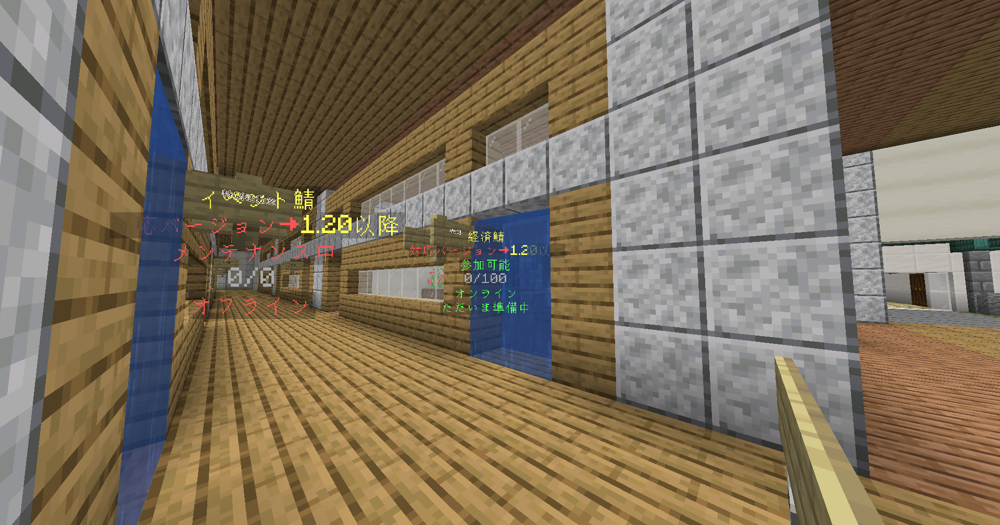
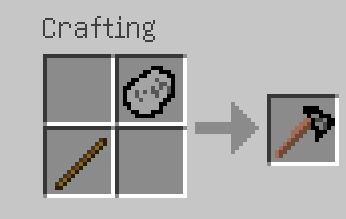
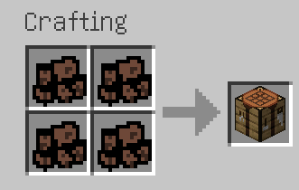
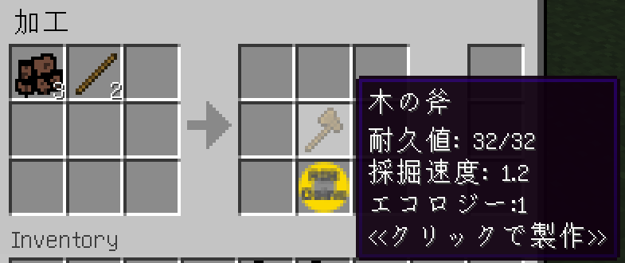
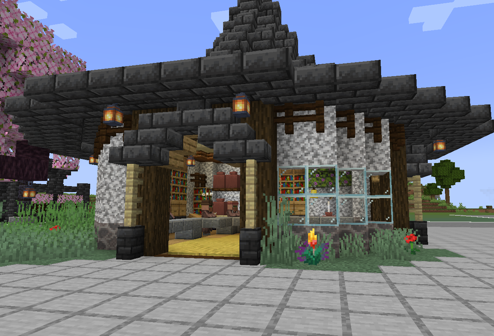

# 【経済鯖の遊び方】

まず、ゲートをくぐって資源ワールドに行きましょう。

!!! warning
    メインワールドでの資源の採集は処罰の対象です！

!!! note ""
    ネザーとエンドは未実装です

## 原始時代編

- [ ] 資源ワールドに降り立ったら、そこらへんの草を素手でむしりましょう。すると確率で"小石"が入手できます。

??? question inline end "もし近くに草がなかったら"
    **/tprandom**と打つとランダムな場所に行くことができます。

!!! tip
    素手では草以外のブロックは壊せません。
    素手以外で草をむしっても何もドロップしません。

- [ ] "小石"を持って、葉ブロックをむしると"木の棒"が手に入ります。

!!! note
    木の棒のドロップ率は低いので、根気よくむしりましょう

- [ ] "小石"と"木の棒"をインベントリでクラフトすると、"ハチェット"が手に入ります。

- [ ] "ハチェット"を持つと原木が切れるようになるので、原木を沢山切って"丸太"を集めましょう。

- [ ] "丸太"を4つインベントリで固めることで、作業台ができます。

!!! warning
    作業台は今の段階で一度作ると撤去できません！置く場所に気をつけましょう

## 木器時代編

- [ ] 作業台で木のツールを一通り作りましょう

??? note "作業台の使い方"
    作業台を開くとメニューが表示されます。 
    まずメニューの「ツール」をクリックすると、現在作れるツールの一覧を見ることができます。 
    その中から更に作りたいツールをクリックすると、ツールを作るための材料が表示されます。 
    右側に表示された完成品をクリックすると、職人に材料と工費を支払ってツールを作ることができます。

    

    !!! tip
        この世界では貴方は自力でクラフトすることができません！ 
        作業台を開くと職人が呼び出されるので、職人にクラフトを依頼しましょう。

??? question "お金がないときは"
    **/sell**をして現れた村人を右クリックした画面に、要らないアイテムを置くことで売ることができます。

!!! success "作業台の「その他」タブで木の棒が作れるようになっています！"
    小石で葉をむしり続ける必要はもうありません

- [ ] 木のツールを一通り作ったら、メニューの「その他」カテゴリにある"木の強化資材"を作りましょう。

??? note "木の強化資材の入手方法"
    - "木くず":作業台で"木材"を作り、設置して"木の斧"（ハチェットではだめ）で壊すとドロップ
    - "塵":シャベルで土を掘ると確率でドロップ
    - "コケ":土や草をクワで耕すと確率でドロップ

!!! tip
    木の斧で木を切るとハチェットより多くの丸太がドロップします。 
    基本的に上位のツールで採取するとより多くの資源が取れるので、新しいツールが作れるようになったら積極的に作っていきましょう！
    
- [ ] "木の強化資材"と、石を掘って入手できる 
"横長の石"と"縦長の石"を組み合わせることで石製のツールを作ることができます。

??? note "ホットバー右上のアイコン「プレイチケット」について"
    - プレイチケットはサーバーにログインしているだけで溜まっていきます
    - スポーン地点のショップビルの中にいる村人からプレイチケットを換金できるショップにアクセスすることができます
    - 序盤を早く進めたい場合なるべくサーバーに入っているようにしましょう!

## 石器時代編

- [ ] まず、"石のつるはし"で石を掘って"丸い石"を、"石のシャベル"で砂利を掘って"火打石"を集めましょう。

!!! note
    石器時代以降では、ツールで採掘を行うと極低確率で敵に襲われるようになります。 
    作業台の「武器」から武器を準備したり、「装備品」から装備を準備したりしましょう。

!!! tip
    この世界で貴方は虚弱なので、武器以外でモブを攻撃することはできません

!!! warning
    木のつるはしで石を掘っても"丸い石"はドロップしません！

- [ ] "丸い石"6個と"火打石"3個でかまどを作ることができます。

??? note "かまどについて"
    かまどでは作業台と同じ手順で"燃料玉"と素材を精錬することでアイテムを加工することができます。 
    現段階で松明を作ることができますが、木炭などはまだ作れません。

- [ ] かまどで鉄もしくは金インゴットを入手しましょう。

!!! warning
    石のつるはしでは鉄鉱石や金鉱石を掘れません

??? note "鉄と金の入手方法"
    砂利を掘ると低確率で"隕鉄"が、砂を掘ると低確率で"砂金"がドロップしますが、
    それらを"灰"と精錬することで"鉄の欠片"、"金の欠片"ができます。 
    欠片を3つクラフトするとインゴットになります。

- [ ] "木の強化資材"、"丸い石"と3種の石を固めることで"石の強化資材"が手に入ります。
??? note "3種の石の入手方法"
    安山岩、花崗岩、閃緑岩を掘るとそれぞれの石バージョンが高確率で落ちます。

- [ ] また、"砂利の粉"、"砂の粉"、"棒"を固めると"強化棒"が手に入ります。

- [ ] これらを金属と組み合わせることで鉄のツールもしくは金のツールを作ることができます。

## 鉄器時代編

!!! abstract
    未実装です

## スキル
- 採掘やクラフトなど特定の行動をするとスキルレベルが上がっていきます。

- **/job**でスキルを習得する画面を開くことができます。

- スキルの効果は説明文の通りです。

- スキルポイントはスキルレベル10あたり1溜まります。
 
 
- 序盤はとりあえず「手斧」「ヘビーリフティング」に振っておくといいでしょう

- スキルリセットは今後ショップでできるようになる予定です

## ショップ

- リスポーン地点付近にショップがあります

- ショップでは色んな限定アイテムを買うことができます。

- 例：

| 名前         | 説明                                 |
| ----------- | ------------------------------------ |
| メインワールド高速破壊杖   | メインワールドで建築するときブロックを素早く壊せる  |
| エメラルド装備   | クラフトの費用が安くなる |

## コマンド

| 名前         | 説明                                 |
| ----------- | ------------------------------------ |
| `mvspawn`   | スポーン地点に行く  |
| `sethome {名前}`       | ホーム地点を設定する |
| `home {名前}`    | ホームにテレポート　|
| `delhome {名前}`    | ホームを削除　|
| `job`    | スキル習得画面を開く　|
| `sell`    | 買い取り商人を呼び出す　|
| `ah`    | オークションUIを呼び出す　|
| `ah sell {値段}`    | 手持ちのアイテムをオークションに出品する　|